- 👋 Hi, I’m @Masze
- 👀 I’m interested in something interesting
- 🌱 I’m currently learning GO
- 💞️
- 📫 wjmaseze@gmail.com

<!---
Masze/Masze is a ✨ special ✨ repository because its `README.md` (this file) appears on your GitHub profile.
You can click the Preview link to take a look at your changes.
--->

```mermaid
graph LR
  A(工业用地效率)-->B1(土地利用强度)
	A-->B2(土地经济效益)
	B1-->C1(容积率)
	B1-->C2(建筑系数)
	B1-->C3(亩均固定资本投入)
	B2-->D1(亩均工业产值)
	B2-->D2(亩均税收)
```

